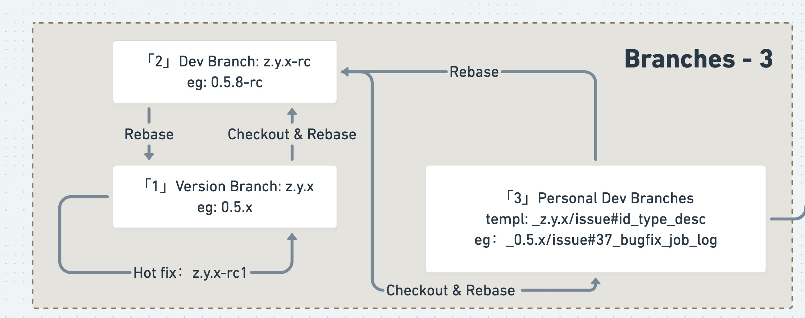
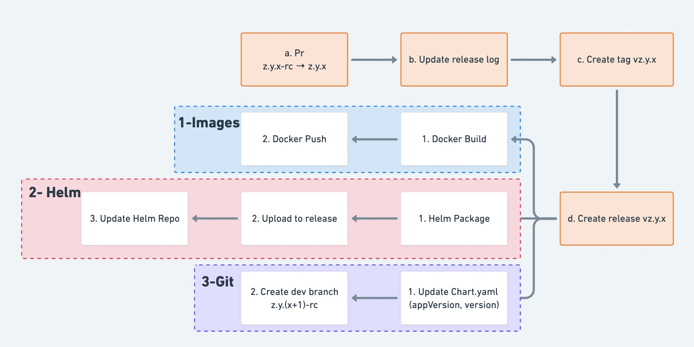
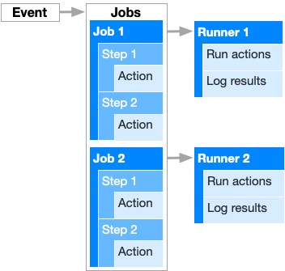
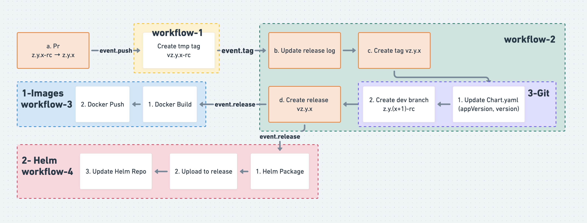
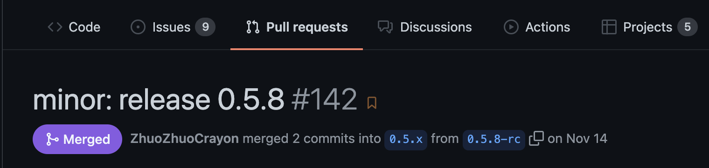
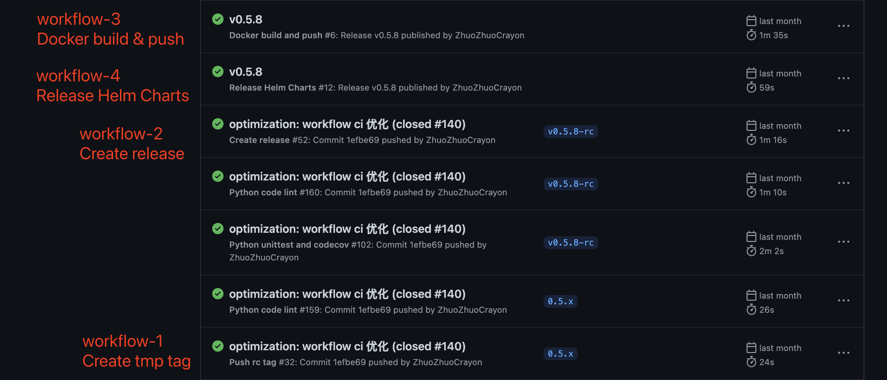
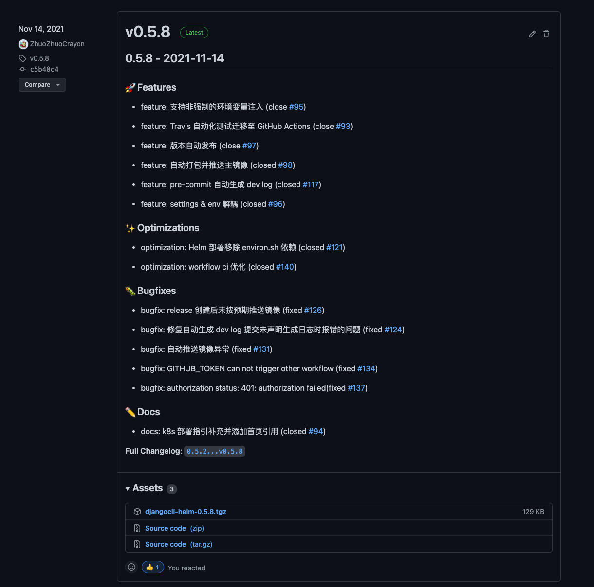
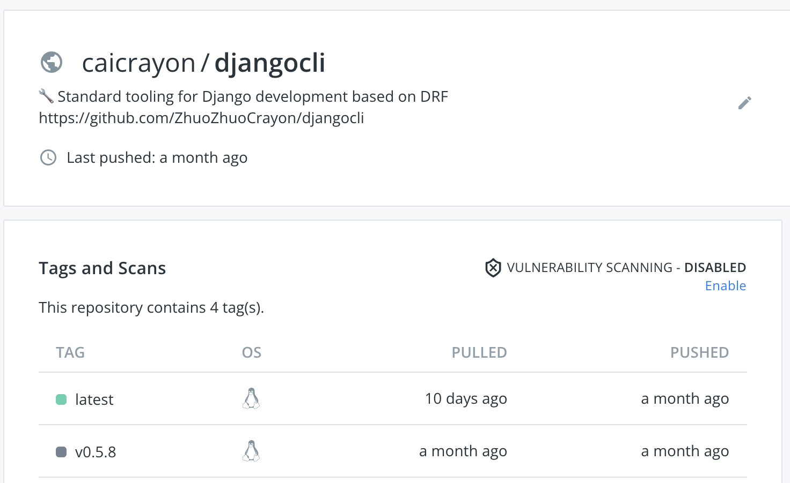
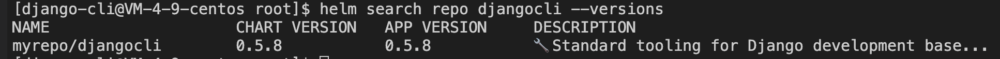

# 使用 GitHub Actions 完成版本自动发布


## 背景


### 分支管理



* 主分支：`z.y.x`，发布时，开发分支合入主分支
* 开发分支：`z.y.x-rc`，`pr` 合入的目标分支
* 代码合入均采用 `rebase` 的方式进行

### 包管理

* 基础镜像
* Helm Chart

### 手动发布如何进行？



#### 0-GitHub

* a. 开发分支合入主分支
* b. 与上个版本进行对比，更新版本日志
* c. d. 创建 `tag` `release`

#### 1-Images

构建并推送镜像到 Docker 仓库

#### 2-Helm

* 打包并推送 Chart包 到 `release`
* 更新 Helm Repo

#### 3-Git

更新 `Chart.yaml` 中的版本信息，创建新的开发分支 `z.y.(x+1)-rc`


### 总结

* 版本发布涉及流程多，操作繁琐，依赖人工发布容易出错且费时
* 借助 `GitHub Actions`，对发布流程进行拆解重构


## GitHub Actions 简介

> 事件驱动型自动化工作流
> 
> 以下介绍引用：[Understanding GitHub Actions](https://docs.github.com/cn/actions/learn-github-actions/understanding-github-actions)



### Workflows

定义在仓库 `.github/workflows` ，可用于完成 `CI/CD` 相关流程的自动化工作流，`workflow` 由单个或多个 `jobs` 组成，可以主动调度或被事件 `event` 触发

### Events

触发 `workflow` 的具体动作，比如 `push`、`pr` 、`webhook` 等，`event` 在 `workflow` 中以 `github.event.{obj}`存在，可以从中获取触发事件的上下文信息，用于流程执行。

* eg：监听 `release`  事件可以在 `workflow` 中使用 `github.event.release` 对象，获取 `name` `upload_url`等信息
*  [GitHub REST API](https://docs.github.com/en/rest/reference) 提供各类 `Ref` 的完整信息

### Jobs

运行在同一 `Runner` 的一组 `steps`，同一 `workflow` 默认以 **并行** 的方式运行多个 `Job`，支持配置 `Job` 间的运行顺序

### Steps

一组包含于 `Job`，用于执行 shell 命令或 `action` 的单元，`step` 间可以通过 `outputs` 共享数据

### Actions

用于执行命令的独立单元，`steps` 由多个`aciton` 组成，`action` 源于开发者自创 或 [GitHub Marketplace](https://github.com/marketplace/)


### Runners

运行 `workflow` 的服务器，默认使用官方构建机，同时也提供托管个人构建机的功能


### workflow 示例
```yaml
name: Python code lint

on: [push, pull_request]

jobs:
  build:
    env:
      PYTHON_VERSION: 3.7

    runs-on: ubuntu-latest

    steps:
    - uses: actions/checkout@v2
    - name: Set up Python ${{ env.PYTHON_VERSION }}
      uses: actions/setup-python@v2
      with:
        python-version: ${{ env.PYTHON_VERSION }}
    - name: Install sependencies
      run: |
        python -m pip install --upgrade pip
        pip install flake8 black
    - name: Lint with flake8
      run: |
        flake8
    - name: Format with black
      run: |
        black .
```
* `on` - 监听 `push` `pull_request` 事件
* `jobs` - `build`
* `steps`
  * 切换到触发事件到 `ref`，`ref` 可以是 `branch` `tag` ...，在上文指 `branch`
  * 安装指定的 Python 版本
  * 安装依赖包
  * 执行 `flake8`
  * 执行 `black`


## 发布流程改造

### 通过事件对发布流程进行拆分

* 发生在 `pull_request` 合并（即主分支 `push` 后）：`0-GitHub`-`b` `c` `d`
* 发生在 `release` 创建后：`1-Helm` `2-Images`
* 可发生在 `release` `tag` 创建后：`3-Git`

手动发布：


基于事件改造：



#### 基于事件拆分为若干 `workflow`

`workflow-1`(`event.push`)：创建临时 `tag`
* 开发分支合入主分支后，创建一个临时 `tag` ->  `vz.y.x-rc`
* 借助一个社区 `action` 生成版本日志，该 `action` 需要已创建的 `tag`
* 由于发布日志需要集成到代码仓库再发布，此时不能打正式版本标签

`workflow-2`(`event.tag`)：生成版本日志并发布
* `0-GitHub`-`b` `c` `d`
* `3-Git`：在 `0-GitHub` 流程包含 `tag` `release` 的创建，所以将 `3-Git` 一并整合成一个 `workflow`

`workflow-3`(`event.release`)：构建并推送镜像

`workflow-4`(`event.release`)：Helm Chart 包构建并推送到 `release`，更新 Helm Repo

下文将继续讨论 `workflows` 的实现


## 先看效果

基于 [发布流程改造](#发布流程改造) 的改造思路，现仅需手动执行 `a.Pr` 步骤，即可完成整个版本发布

### 将开发分支通过 `pull request` 的方式合入




### 自动触发 Actions




上述 Actions 执行完后，在 GitHub Releases 可以查看最新的 Release



构建并推送镜像到 Docker Hub



Helm Repo 的 包版本也通过相应的 Actions 更新

```shell
# 更新 charts 包信息
helm repo update
# 查找 djangocli 的全部版本
helm search repo djangocli --versions

# 更新部署到 k8s
helm upgrade djangocli myrepo/djangocli --version=0.5.8 -f djangocli-private-values.yaml
```




## workflow 实现

省略部分实现细节，完整实现参考：[ZhuoZhuoCrayon/djangocli](https://github.com/ZhuoZhuoCrayon/djangocli)

### 创建临时 `tag`（workflow-1）

使用 [GitHub Action - GitHub Script](https://github.com/marketplace/actions/github-script) 快速实现 tag 创建
```yaml
  - id: create-temporary-tag
    name: Create temporary tag
    uses: actions/github-script@v5
    with:
      github-token: ${{ secrets.PAT }}
      script: |
        github.rest.git.createRef({
          owner: context.repo.owner,
          repo: context.repo.repo,
          ref: 'refs/tags/${{ env.TEMPORARY_TAG_NAME }}',
          sha: context.sha
        })
```

* `github`：js-github客户端，参考 [octokit/rest.js](https://octokit.github.io/rest.js/v18) 
* `context`：`workflow` 运行时上下文，参考源码提供的属性值：[context.ts](https://github.com/actions/toolkit/blob/main/packages/github/src/context.ts)

调用其他 GitHub 接口也类似，基于 `github` `context`，即可构造接口调用地址及参数


### 生成版本日志并发布（workflow-2）

#### 2-1 生成版本日志
> Action: [Release Changelog Builder](https://github.com/marketplace/actions/release-changelog-builder)

```yaml
  - id: build-release-log
    name: Build release log
    uses: mikepenz/release-changelog-builder-action@v2
    with:
      configuration: ".github/configuration.json"
      commitMode: true
      ignorePreReleases: true
    env:
      GITHUB_TOKEN: ${{ secrets.GITHUB_TOKEN }}
```

* 该 `action` 会拉去版本间的提交信息，根据 `.github/configuration.json` 配置生成版本日志

```json
{
    "categories": [
      // 省略部分 categories
      {
        "title": "### 🔥 Refactors",
        "labels": ["kind/refactor", "refactor"]
      }
    ],
    "template": "${{CHANGELOG}}\n**Full Changelog**: __GITHUB_REPO_URL__/compare/${{FROM_TAG}}...__TO_TAG___",
    "pr_template": "- ${{TITLE}}\n",
    "label_extractor": [
      {
        "pattern": "(feature|docs|bugfix|optimization|refactor|test): (.*)",
        "target": "$1"
      }
    ],
    "duplicate_filter": {
      "pattern": "github.*",
      "on_property": "author",
      "method": "match"
    }
}
```
* `label_extractor`：`commit_msg` 已制定规范，通过正则的方式提取相关标签
* `duplicate_filter`：忽略 `github` 机器人的提交


#### 2-2 删除临时创建的 `tag`

#### 2-3 推送版本日志

```yaml
  - id: push-release-log
    name: Push release log
    run: |

      # 获取发布日志路径并更新发布日志
      echo "${{ steps.build-release-log.outputs.changelog }}" >> /tmp/log.md
      # mikepenz/release-changelog-builder-action 无法使用输出变量 steps.build-release-log.outputs.fromTag，暂时采用模板渲染的方式
      sed -i "s|__TO_TAG___|${{ env.TAG_NAME }}|g" /tmp/log.md
      sed -i "s|__GITHUB_REPO_URL__|${{ env.GITHUB_REPO_URL }}|g" /tmp/log.md
      release_log_path=$( python scripts/workflows/release/upgrade_release_log.py -r ${{ env.RELEASE_LOG_ROOT }} -v ${{ env.PRERELEASE_VERSION }} -l /tmp/log.md )

      # 切换到默认分支
      git checkout ${{ env.DEFAULT_BRANCH }}
      # 推送发布日志
      git add .
      git commit -m "minor: auto push ${{ env.PRERELEASE_VERSION }} release log"
      git push origin ${{ env.DEFAULT_BRANCH }}

      # 设置输出
      echo "::set-output name=release_log_path::$(echo $release_log_path)"
```

#### 2-4 创建 `tag`

#### 2-5 `3-Git` 创建新开发分支

```yaml
  - id: start-new-version
    name: Start new version
    run: |
      # 获取下一个版本
      next_version=$( python scripts/workflows/release/version_increment.py --version ${{ env.PRERELEASE_VERSION }} )
      # 检出新开发分支
      dev_branch_name=$( echo "${next_version}${{ env.DEV_BRANCH_SUFFIX }}" )
      git checkout -b "$dev_branch_name"
      # 开发分支写入预发布版本号
      python scripts/workflows/release/op_yaml.py -f ${{ env.APP_DESC_YAML }} --keyword-path ${{ env.VERSION_KW_P }} --op set --value "$next_version"
      # 同步更改chart版本
      python scripts/workflows/release/op_yaml.py -f .helm/Chart.yaml --keyword-path version --op set --value "$next_version"
      # 推送到仓库
      git add . && git commit -m "minor: start new version $next_version" && git push origin "$dev_branch_name"
```

#### 2-6 创建 Release
> Action: [Create Release](https://github.com/marketplace/actions/create-release)

```yaml
  - id: create-release
    name: Create release
    uses: actions/create-release@latest
    env:
      GITHUB_TOKEN: ${{ secrets.PAT }}
    with:
      tag_name: ${{ env.TAG_NAME }}
      release_name: ${{ env.TAG_NAME }}
      body_path: ${{ steps.push-release-log.outputs.release_log_path }}
      draft: false
      prerelease: true
```

* 自动化流程中，设置 `release` 为 `prerelease(预发布)`，待测试或检查无误后，再正式发布


### 构建并推送镜像（workflow-3）
> Action: [Build and push Docker images](https://github.com/marketplace/actions/build-and-push-docker-images)

```yaml
  - id: set-up-qemu
    name: Set up QEMU
    uses: docker/setup-qemu-action@v1

  - id: set-up-docker-buildx
    name: Set up Docker Buildx
    uses: docker/setup-buildx-action@v1

  - id: login-to-dockerhub
    name: Login to DockerHub
    uses: docker/login-action@v1
    with:
      username: ${{ secrets.DOCKERHUB_USERNAME }}
      password: ${{ secrets.DOCKERHUB_TOKEN }}

  - id: build-and-push
    name: Build and push
    uses: docker/build-push-action@v2
    with:
      push: true
      tags: ${{ secrets.DOCKERHUB_USERNAME }}/${{ env.DOCKER_REPO_NAME }}:latest,${{ secrets.DOCKERHUB_USERNAME }}/${{ env.DOCKER_REPO_NAME }}:${{ github.event.release.name }}
      file: scripts/services/k8s/images/app/Dockerfile
```

* `${{ secrets.DOCKERHUB_USERNAME }}` `${{ secrets.DOCKERHUB_TOKEN }}` 
  * 参考 [DockerHub access token](https://docs.docker.com/docker-hub/access-tokens/) 获取仓库 `token`
  * 参考 [GitHub encrypted-secrets](https://docs.github.com/en/actions/security-guides/encrypted-secrets) 将 DockerHub 用户名、TOKEN 添加到仓库，即可在 `workflow` 中使用
* 具体使用参考：[Build and push Docker images](https://github.com/marketplace/actions/build-and-push-docker-images)


### 推送 Helm Chart 包（workflow-4）

#### 4-1 Helm 打包

```yaml
  - name: Install Helm
    uses: azure/setup-helm@v1
    with:
      version: v3.4.0
  - id: helm-package
    name: Helm package
    run: |
      # 初始化临时打包目录
      rm -rf ${{ env.TMP_CHARTS_DIR }} & mkdir -p ${{ env.TMP_CHARTS_DIR }}
      # Chart 打包
      helm package ${{ env.CHART_PATH }} -u -d ${{ env.TMP_CHARTS_DIR }}
```

* 安装指定的 Helm 版本：[Helm tool installer](https://github.com/marketplace/actions/helm-tool-installer)


#### 4-2 上传 Chart包 
> Action: [upload-release-asset](https://github.com/actions/upload-release-asset)

```yaml
  - id: upload-helm-chart-package
    name: Upload Helm Chart package
    # 参考：https://github.com/actions/upload-release-asset
    uses: actions/upload-release-asset@v1.0.2
    env:
      GITHUB_TOKEN: ${{ secrets.PAT }}
    with:
      upload_url: ${{ env.RELEASE_UPLOAD_URL }}
      asset_path: ${{ env.TMP_CHARTS_DIR }}/${{ env.HELM_PKG_NAME }}
      asset_name: ${{ env.HELM_PKG_NAME }}
      asset_content_type: application/octet-stream
```


## 排坑

### 合理使用 `Personal Access Token`

结合改造图可以发现，改造后存在 workflow 通过创建 `tag` `release`，其他的 `workflow` 监听此类事件并执行

触发创建需要使用 TOKEN，`workflow` 默认提供了 `${{ secrets.GITHUB_TOKEN }}`，为了避免 `workflow` 间的递归触发，由 GITHUB_TOKEN 触发的事件不会使 `workflow` 执行

如果需要 `workflow` -> `workflow` 间的触发，可以创建 [Personal Access Token](https://docs.github.com/en/authentication/keeping-your-account-and-data-secure/creating-a-personal-access-token)

该问题最初发现于使用 `secrets.GITHUB_TOKEN` 创建的 `release`，不会触发另一个监听 `release` 事件的 `workflow` 执行
* [Create Release](https://github.com/actions/create-release)
* [Create Release 对该问题的文档补充](https://github.com/actions/create-release/pull/115/files)
* [GitHub Actions 对此限制的说明](https://docs.github.com/en/actions/learn-github-actions/events-that-trigger-workflows#triggering-new-workflows-using-a-personal-access-token)

后文的 `${{ secrets.PAT }}` 就是一个 `Personal Access Token`，用于 `tag` `release` 等需要触发其他 `workflow` 的事件源的创建中


## 未完待续

### 支持通过 `pull requests` 的方式生成版本日志

[Release Changelog Builder](https://github.com/marketplace/actions/release-changelog-builder) 是目前社区相对来说功能比较完备的自动生成发布日志 action，但对 `rebase` 合入模式支持不友好

从源码得知，该 action 通过拉取 `fromTag` `toTag` 之间的 `commit` 、`pull request`，通过校验 `commit sha` 的方式，过滤出已合入的 `pr`，过滤逻辑如下 ⬇️

```ts
// create array of commits for this release
const releaseCommitHashes = prCommits.map(commmit => {
  return commmit.sha
})

// retrieve base branches we allow
const baseBranches =
  configuration.base_branches || DefaultConfiguration.base_branches
const baseBranchPatterns = baseBranches.map(baseBranch => {
  return new RegExp(baseBranch.replace('\\\\', '\\'), 'gu')
})
// return only the pull requests associated with this release
// and if the baseBranch is matching the configuration
return pullRequests.filter(pr => {
  let keep = releaseCommitHashes.includes(pr.mergeCommitSha)
  if (keep && baseBranches.length !== 0) {
    keep = baseBranchPatterns.some(pattern => {
      return pr.baseBranch.match(pattern) !== null
    })
  }
  return keep
})
```

由于项目采用 `rebase` 的方式，根据 [GitHub About pull request merges](https://docs.github.com/en/pull-requests/collaborating-with-pull-requests/incorporating-changes-from-a-pull-request/about-pull-request-merges) 中 `"Rebase and merge on GitHub will always update the committer information and create new commit SHAs"`
得知，通过判断 `pr` 的 `mergeCommitSha` 是否存在于指定的分支是不可行的

在 [2-1 生成版本日志](#2-1-生成版本日志) 指定 `commitMode=true` 作为临时解决方案

* 通过 `tag` 间的提交信息生成日志，在使用中发现 `pr` 存在多提交、`commit` 依赖团队成员的提交规范 等问题，最终希望切到 `pr` 生成日志的模式

* 后面会对该 action 进行修改，初步考虑添加信任模式，仅校验 `pr` 的合入目标分支以及合入状态
  * 暂不考虑目标分支被强推导致 `pr` 失效，该场景可以通过贴 `label` 等方式过滤

### 维护个人开发者的 Helm Repo


### workflows 复用

在应用到多个项目过程中发现，如果能对定义的 `workflows` 提取通用功能，独立仓库进行维护，便可以减少各个项目间适配，`workflows` 不好统一维护升级的缺点

后续应基于 [Reusing workflows](https://docs.github.com/cn/actions/learn-github-actions/reusing-workflows) 实现多项目复用


## 参考 🔗

### GitHub Actions

* [GitHub Actions 官方文档](https://docs.github.com/en/actions)
* [GitHub Marketplace - Find tools to improve your workflow](https://github.com/marketplace/)
  * 🔧 开发工具
  * 各类 Actions
* [GitHub REST API](https://docs.github.com/en/rest/reference)
* [octokit/rest.js](https://octokit.github.io/rest.js/v18)
* [GitHub Actions - GitHub Script](https://github.com/marketplace/actions/github-script)
  * 在 Actions 中快速使用 GitHub API
* [GitHub event types](https://docs.github.com/en/developers/webhooks-and-events/events/github-event-types)
* [GitHub encrypted-secrets](https://docs.github.com/en/actions/security-guides/encrypted-secrets)
* [GitHub Actions Contexts](https://docs.github.com/en/actions/learn-github-actions/contexts)

### 版本管理

* [语义化版本 - Semantic Versioning 2.0.0](https://semver.org/)

### Helm

* [Helm 官方文档](https://helm.sh/)

