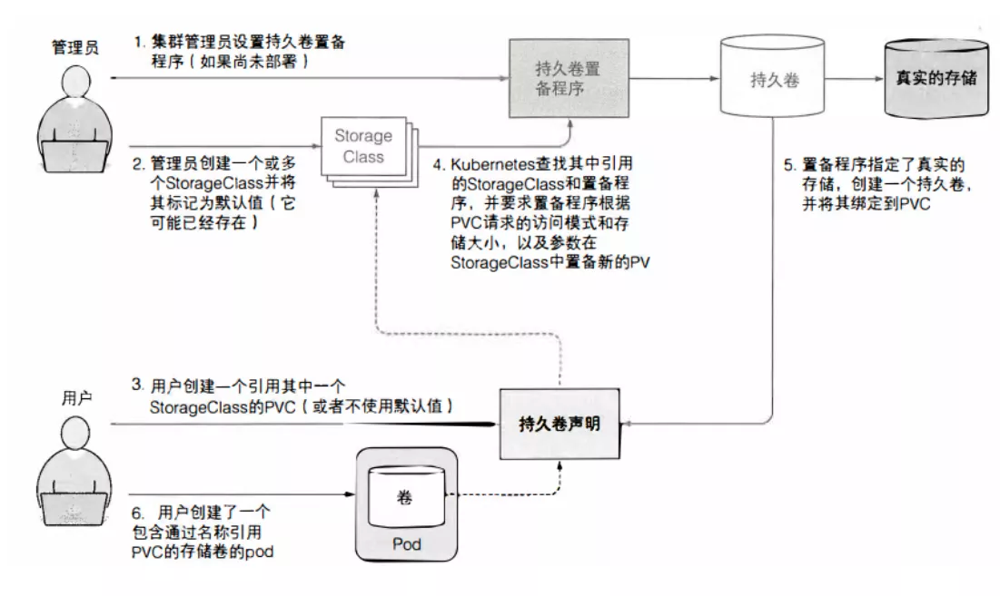

# 搭建 k8s 集群

## 1. 准备开始

> 以下介绍本文搭建所用的配置，关于 kubeadm 搭建的最小配置，可参考：[安装 kubeadm-准备开始](https://kubernetes.io/zh-cn/docs/setup/production-environment/tools/kubeadm/install-kubeadm/#%E5%87%86%E5%A4%87%E5%BC%80%E5%A7%8B)
>

* 内网互联的四台 2核4G 的 OpenCloudOS 8.6（基于 CentOS 8.x） 主机
    * 127.0.0.1 - `127-0-0-1-master`
    * 127.0.0.2 - `127-0-0-2-node`
    * 127.0.0.3 - `127-0-0-3-node`
    * 127.0.0.4 - `127-0-0-4-nfs-node`
* 一块 100G 的高性能云硬盘

### 1.1 安全组配置

* [Kubenetes 端口和协议](https://kubernetes.io/zh-cn/docs/reference/networking/ports-and-protocols/)
* Fannel - 8285,8472(UDP)

## 2. 服务器初始化

> 以下指令均以 sudo 权限执行

### 2.1 环境配置

更新软件源

```shell
# 更新软件源  
yum update -y
```

调整内核参数
>
参考：[转发 IPv4 并让 iptables 看到桥接流量](https://kubernetes.io/zh-cn/docs/setup/production-environment/container-runtimes/#%E8%BD%AC%E5%8F%91-ipv4-%E5%B9%B6%E8%AE%A9-iptables-%E7%9C%8B%E5%88%B0%E6%A1%A5%E6%8E%A5%E6%B5%81%E9%87%8F)

```shell
sed -ri.k8s.bak '/k8s config begin/,/k8s config end/d' /etc/sysctl.conf
cat >> "/etc/sysctl.conf" << EOF
# k8s config begin  
# 为了支持 k8s service, 必须开启  
net.ipv4.ip_forward=1
# 使得 Linux 节点的 iptables 能够正确查看桥接流量
net.bridge.bridge-nf-call-ip6tables=1
net.bridge.bridge-nf-call-iptables=1
# k8s config end
EOF
sysctl --system
```

设置主机名及相应的域名解析
> 非必要，用于保证可读性，后面操作把主机名的表达都改为实际 IP 即可

```shell
# 设置主机名
hostnamectl set-hostname 127-0-0-1-master
# 添加域名解析
sed -ri.k8s.hosts.bak '/k8s hosts begin/,/k8s hosts end/d' /etc/hosts  
cat >> "/etc/hosts" << EOF  
# k8s hosts begin  
127.0.0.1 k8scp
127.0.0.1 127-0-0-1-master
127.0.0.2 127-0-0-2-node
127.0.0.3 127-0-0-3-node
127.0.0.4 127-0-0-4-nfs-node
# k8s hosts end  
EOF
```

禁用交换分区
> 如果不满足，系统会有一定几率出现 io 飙升

```shell
swapoff -a
sed -i '/ swap / s/^\(.*\)$/#\1/g' /etc/fstab
# 禁用 selinux
sed -i 's/enforcing/disabled/' /etc/selinux/config
setenforce 0
cat /etc/selinux/config
```

重启确保配置生效

```shell
reboot
```

### 2.2 初始化 containerd

> ❗️ 自 1.24 版起，Dockershim 已从 Kubernetes 项目中移除，可以使用 [containerd](https://kubernetes.io/zh-cn/docs/setup/production-environment/container-runtimes/#containerd) 作为 CRI 运行时
>

添加官方仓库

```shell
yum config-manager --add-repo https://download.docker.com/linux/centos/docker-ce.repo
yum clean all
yum makecache
yum install -y -q yum-utils
```

安装 containerd

```shell
yum install containerd.io -y
CONTAINDERD_CONFIG_PATH=/etc/containerd/config.toml && \
rm -f "${CONTAINDERD_CONFIG_PATH}" && \
containerd config default > "${CONTAINDERD_CONFIG_PATH}" && \
sed -i "s/SystemdCgroup = false/SystemdCgroup = true/g"  "${CONTAINDERD_CONFIG_PATH}"
systemctl enable --now containerd && \
systemctl restart containerd
```

### 2.3 [可选] 初始化 Docker

> ❗️Docker 安装不是 k8s 集群搭建的必须步骤，按需安装即可

安装 docker

```shell
yum -y install docker-ce-cli docker-ce
```

依赖目录创建

```shell
# 在 data 目录下创建 docker 的数据目录  
install -dv /data/lib/docker
# 在 etc 目录下创建 docker 配置文件目录
install -dv /etc/docker
```

创建 docker 配置文件

`registry-mirrors` 是镜像源配置，国内从 Docker Hub 拉取镜像有时会遇到困难，此时可以配置镜像加速器，本文使用腾讯云的镜像加速器，更多配置方法请参考：[镜像加速器](https://yeasy.gitbook.io/docker_practice/install/mirror)

```shell
cat << EOF | sudo tee /etc/docker/daemon.json
{
  "data-root": "/data/lib/docker",
  "exec-opts": ["native.cgroupdriver=systemd"],
  "registry-mirrors": [
    "https://mirror.ccs.tencentyun.com"
  ],
  "max-concurrent-downloads": 10,
  "live-restore": false,
  "log-level": "info",
  "log-opts": {
    "max-size": "100m",
    "max-file": "5"
  },
  "storage-driver": "overlay2"
}
EOF
```

在 Docker 启动时将 FORWARD chain 默认策略设为 ACCEPT

```shell
install -dv /etc/systemd/system/docker.service.d/
cat << EOF | sudo tee /etc/systemd/system/docker.service.d/k8s-docker.conf  
[Service]  
ExecStartPost=/sbin/iptables -P FORWARD ACCEPT  
EOF
```

启动 Docker

```shell
systemctl daemon-reload
# 托管 Docker 进程
systemctl enable --now docker
```

检查 Docker 配置

```shell
systemctl cat docker | grep docker.service
```

将输出以下两个配置：

* `/usr/lib/systemd/system/docker.service`
* `/etc/systemd/system/docker.service.d/k8s-docker.conf`

验证 Docker 功能可用

```shell
docker run --rm docker.io/library/hello-world:latest
docker run -it ubuntu bash
```

### 2.3 安装 Kubeadm

添加源

```shell
# 此操作会覆盖 /etc/yum.repos.d/kubernetes.repo 中现存的所有配置
cat <<EOF | sudo tee /etc/yum.repos.d/kubernetes.repo
[kubernetes]
name=Kubernetes
baseurl=https://pkgs.k8s.io/core:/stable:/v1.30/rpm/
enabled=1
gpgcheck=1
gpgkey=https://pkgs.k8s.io/core:/stable:/v1.30/rpm/repodata/repomd.xml.key
exclude=kubelet kubeadm kubectl cri-tools kubernetes-cni
EOF
```

安装依赖

```shell
yum install -y kubelet kubeadm kubectl --disableexcludes=kubernetes
```

启动 kubelet

```shell
install -dv /data/lib/kubelet
cat << EOF | sudo tee /etc/sysconfig/kubelet  
KUBELET_EXTRA_ARGS="--root-dir=/data/lib/kubelet"
EOF
systemctl enable --now kubelet
```

创建 etcd 数据目录

```shell
install -dv /data/lib/etcd
```

## 3. 集群配置

### 3.1 配置 master 节点

#### 3.1.1 初始化 kubeadm

创建 kubeadm 配置

```shell
cat << EOF | tee "$HOME/kubeadm-config.yaml"  
apiVersion: kubeadm.k8s.io/v1beta3
kind: ClusterConfiguration
kubernetesVersion: 1.30.0
apiServer:
  extraArgs:
    authorization-mode: Node,RBAC
  timeoutForControlPlane: 4m0s
certificatesDir: /etc/kubernetes/pki
clusterName: kubernetes
# fixme: 这里也可以直接使用 IP
controlPlaneEndpoint: k8scp:6443
controllerManager: {}
etcd:
  local:
    # etcd数据目录推荐放到数据盘中
    dataDir: /data/lib/etcd
imageRepository: registry.k8s.io
networking:
  dnsDomain: cluster.local
  podSubnet: 10.244.0.0/16
  serviceSubnet: 10.96.0.0/12
scheduler: {}
---
apiVersion: kubeadm.k8s.io/v1beta3
kind: InitConfiguration
nodeRegistration:
  # fixme: 这里也可以直接使用 IP
  name: 10-0-4-9-master
---
apiVersion: kubeproxy.config.k8s.io/v1alpha1
kind: KubeProxyConfiguration
# kube-proxy 采用 ipvs 模式
mode: ipvs
EOF
```

初始化 kubeadm

```shell
kubeadm init --config=kubeadm-config.yaml --upload-certs | tee kubeadm-init.out
```

kubeconfig 配置

```shell
export KUBECONFIG=/etc/kubernetes/admin.conf
mkdir -p $HOME/.kube  
cp -i /etc/kubernetes/admin.conf $HOME/.kube/config  
chown $(id -u):$(id -g) $HOME/.kube/config
```

#### 3.1.2 网络插件

Flannel 是作为一个二进制文件的方式部署在每个 node 上，主要实现两个功能：

- 为每个 node 分配 subnet，容器将自动从该子网中获取 IP 地址
- 当有 node 加入到网络中时，为每个 node 增加路由配置

```shell
kubectl apply -f https://raw.githubusercontent.com/flannel-io/flannel/master/Documentation/kube-flannel.yml
```

通过部署 Nginx 快速体验

```shell
kubectl create deployment nginx --image=nginx
# 暴露 nginx 端口
kubectl expose deployment nginx --port 80 --type=NodePort
```

#### 3.1.3 [可选] 允许 master / control-plane 调度

非生产集群为了提升可调度资源，可以去掉污点允许 master / cp 节点被调度

```shell
kubectl taint nodes --all node-role.kubernetes.io/master:NoSchedule-
kubectl taint nodes --all node-role.kubernetes.io/control-plane:NoSchedule-
```

#### 3.1.4 其他工具

安装 Helm

```shell
curl -fsSL -o get_helm.sh https://raw.githubusercontent.com/helm/helm/main/scripts/get-helm-3  
chmod 700 get_helm.sh  
./get_helm.sh
```

安装 k9s

```shell
wget https://github.com/derailed/k9s/releases/download/v0.25.18/k9s_Linux_x86_64.tar.gz  
tar -zxf k9s_Linux_x86_64.tar.gz -C /usr/local/bin  
k9s help  
k9s info
```

为 k8s 提供各项性能指标

```shell
wget https://github.com/kubernetes-sigs/metrics-server/releases/latest/download/components.yaml
# L140 加上配置  
#         - --kubelet-insecure-tls=true
#         - --kubelet-preferred-address-types=InternalIP
vim components.yaml
kubectl apply -f components.yaml
```

#### 3.1.5 获取 join 命令

获取加入其他节点的命令

```shell
kubeadm token create --print-join-command
```

### 3.2 其他节点配置

加入集群

```shell
kubeadm join k8scp:6443 --token {fixme: your token} --discovery-token-ca-cert-hash xxxxx
```

### 3.3 删除节点 / 重新初始化

```shell
#【可选】删除已过期的 k8s repo
rm -f /etc/yum.repos.d/kubernetes.repo
yum clean all
yum makecache

# 重置 k8s
yum install -y ipvsadm
kubeadm reset -f
ipvsadm --clear

# 停全部容器
docker ps -q | xargs -r docker stop
# 删除全部容器
docker ps -a -q | xargs -r docker rm -f
# 删除全部镜像
docker images -q | xargs -r docker rmi
# 清理未使用资源
docker system prune -af

# 删除 docker
dnf remove containerd.io -y
yum remove docker-ce-cli -y
rm -rf /data/lib/docker

# 取消挂载
sed -ri.k8s.bak '/k8s config begin/,/k8s config end/d' /etc/fstab
umount /nfs-storage/data
mount -a
mount | grep nfs
```

## 4. 搭建共享存储

### 4.1 为什么需要

Container 中的文件在磁盘上是临时存放的，这给 Container 中运行的较重要的应用程序带来一些问题。

* 当容器崩溃时文件丢失。 kubelet 会重新启动容器，但容器会以干净的状态重启。
* 问题会在同一 `Pod` 中运行多个容器并共享文件时出现。
  Kubernetes [卷（Volume）](https://kubernetes.io/zh-cn/docs/concepts/storage/volumes/) 这一抽象概念能够解决这两个问题。



以下内容将说明如何提供基于 NFS 的制备器（Provisioner），关于存储制备器的更多内容，请参考：[存储制备器](https://kubernetes.io/zh-cn/docs/concepts/storage/storage-classes/#provisioner)

### 4.2 存储初始化（仅 `127-0-0-4-nfs-node`）

在 `127-0-0-4-nfs-node` 挂载了一块 100G 的高性能云硬盘，作为 NFS 存储

查看磁盘信息

```shell
fdisk -l
```

其中，`/dev/vda` 是系统盘，`/dev/vdb` 是挂载的云硬盘

```
Disk /dev/vda: 30 GiB, 32212254720 bytes, 62914560 sectors
Units: sectors of 1 * 512 = 512 bytes
Sector size (logical/physical): 512 bytes / 512 bytes
I/O size (minimum/optimal): 512 bytes / 512 bytes
Disklabel type: dos
Disk identifier: 0x4c5be527

Device     Boot Start      End  Sectors Size Id Type
/dev/vda1        2048 62914526 62912479  30G 83 Linux


Disk /dev/vdb: 100 GiB, 107374182400 bytes, 209715200 sectors
Units: sectors of 1 * 512 = 512 bytes
Sector size (logical/physical): 512 bytes / 512 bytes
I/O size (minimum/optimal): 512 bytes / 512 bytes
```

创建文件系统格式

```shell
mkfs -t ext4 /dev/vdb
```

创建并将新建的文件分区挂载到 `/nfs-storage/`

```shell
mkdir -p /nfs-storage/data  
mount /dev/vdb /nfs-storage
```

获取磁盘的 `UUID`

```
/dev/vdb: UUID=${UUID} BLOCK_SIZE="4096" TYPE="ext4"
```

将 `UUID=${UUID} /nfs-storage ext4 defaults 0 0` 写入 `/etc/fstab`，用于确保开机自动挂载，以下命令用于检查写入是否成功

```shell
mount -a
df -TH
```

### 4.3 搭建 NFS 服务（仅 `127-0-0-4-nfs-node`）

安装并启动依赖

```shell
yum install rpcbind nfs-utils
systemctl start rpcbind 
systemctl enable rpcbind
systemctl start nfs-server
systemctl enable nfs-server
```

配置 NFS，对其他节点进行授权
> 配置参考：[exports](https://linux.die.net/man/5/exports#content:%7E:text=General%20Options)

配置解读：

* `rw` - 读写权限
* `insecure` - The insecure option in this entry also allows clients with NFS implementations that don't use a reserved
  port for NFS（允许不使用保留端口）
* `sync` - 同时将数据写入到内存与硬盘中
* `no_subtree_check`  - 不检查父目录权限
* `no_root_squash` - 当 NFS 客户端使用 root 用户访问时，映射到 NFS 服务器的 root 用户

```shell
## NFS 共享目录文件配置  
## 参考：https://www.huweihuang.com/linux-notes/tools/nfs-usage.html  
sed -ri.k8s.bak '/k8s config begin/,/k8s config end/d' /etc/exports  
cat >> "/etc/exports" << EOF  
# k8s config begin  
/nfs-storage/data 127-0-0-1-master(rw,insecure,sync,no_subtree_check,no_root_squash)  
/nfs-storage/data 127-0-0-4-nfs-node(rw,insecure,sync,no_subtree_check,no_root_squash)  
/nfs-storage/data  127-0-0-2-node(rw,insecure,sync,no_subtree_check,no_root_squash)  
/nfs-storage/data 127-0-0-3-node(rw,insecure,sync,no_subtree_check,no_root_squash)  
# k8s config end  
EOF
```

检查挂载

```shell
exportfs -ra
showmount -e
fuser -m -v /nfs-storage
```

查看其他节点是否正常与服务端通信

```shell
netstat | grep :nfs
```

### [可选] 4.4 搭建 NFS 客户端（其他节点）
> ❗️如果希望在宿主机间共享文件，可以考虑挂载 nfs，不然建议不挂载，毕竟在多写场景文件同步也是挺大的 IO 消耗

安装依赖

```shell
yum install -y nfs-utils
```

挂载 NFS

```shell
mkdir -p /nfs-storage/data
mount -t nfs 127-0-0-4-nfs-node:/nfs-storage/data /nfs-storage/data
```

设置开机自动挂载

```shell
# 开机自动挂载  
sed -ri.k8s.bak '/k8s config begin/,/k8s config end/d' /etc/fstab
cat >> "/etc/fstab" << EOF  
# k8s config begin  
127-0-0-4-nfs-node:/nfs-storage/data    /nfs-storage/data    nfs    defaults    0 0  
# k8s config end  
EOF

# 重新挂载检查配置是否生效
mount -a
```

### 4.5 部署 NFS Provisioner（master 节点）

> `NFS-Subdir-External-Provisioner`是一个自动配置卷程序，它使用现有的和已配置的 NFS 服务器来支持通过持久卷声明动态配置 Kubernetes 持久卷。

指定 `nfs.server` `nfs.path` 进行创建

```shell
helm repo add nfs-subdir-external-provisioner https://kubernetes-sigs.github.io/nfs-subdir-external-provisioner/
helm install nfs-provisioner nfs-subdir-external-provisioner/nfs-subdir-external-provisioner --set nfs.server=127-0-0-4-nfs-node --set nfs.path=/nfs-storage/data/ --set storageClass.defaultClass=true
```

## 5. 更新 Kubernetes 证书

查看证书过期时间

```shell
kubeadm certs check-expiration
```

备份旧证书

```shell
cp -r /etc/kubernetes /etc/kubernetes.old
```

在每个 master 节点上执行

```shell
kubeadm certs renew all
```

在每个 master 节点管理重启

```shell
docker ps |egrep "k8s_kube-apiserver|k8s_kube-scheduler|k8s_kube-controller"|awk '{print $1}'|xargs docker restart
```

更新 ~/.kube/config 文件

```shell
sudo cp -i /etc/kubernetes/admin.conf $HOME/.kube/config
sudo chown $(id -u):$(id -g) $HOME/.kube/config
```

## 6. 参考资料

* [Kubernetes 文档](https://kubernetes.io/zh-cn/)
* [Docker 从入门到实践](https://yeasy.gitbook.io/docker_practice/)
* [Kubernetes 集群部署 NFS-Subdir-External-Provisioner 存储插件](https://developer.aliyun.com/article/856853)
* [Kubernetes Configuration APIs](https://kubernetes.io/docs/reference/config-api/)
* [云原生资料库](https://lib.jimmysong.io/)
* [Certificate Management with kubeadm](https://kubernetes.io/docs/tasks/administer-cluster/kubeadm/kubeadm-certs/)