# Datadog 功能体验

## 1. 依赖安装

### 1.0 接入交互

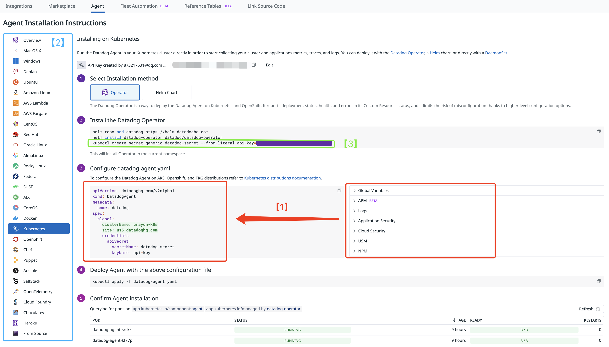

* *[1] 关联观测、集成场景，可以预设需要开启的功能，并生成具体的 Yaml 配置*
* *[2] 根据「接入对象」，提供具体指引*
* *[3] 内置 API Key，不同场景共享同一个 Key*
* *参考：[Install the Datadog Agent on Kubernetes](https://docs.datadoghq.com/containers/kubernetes/installation/?tab=datadogoperator)*

### 1.1 安装 Datadog Operator

```shell
helm repo add datadog https://helm.datadoghq.com
helm install datadog-operator datadog/datadog-operator
kubectl create secret generic datadog-secret --from-literal api-key=<Your API Key>
```

### 1.2 部署 Agent

#### 1.2.1 配置 datadog-agent.yaml

```yaml
apiVersion: datadoghq.com/v2alpha1
kind: DatadogAgent
metadata:
  name: datadog
spec:
  global:
    # [1]
    kubelet:
      tlsVerify: false
    clusterName: crayon-k8s
    # [2]
    site: us5.datadoghq.com
    credentials:
      apiSecret:
        secretName: datadog-secret
        keyName: api-key
```

* *[1] 自建 k8s 集群禁用 TLS 解决 "impossible to reach Kubelet with host"
  的报错，参考：[Accessing the Kubelet API](https://docs.datadoghq.com/agent/troubleshooting/hostname_containers/?tab=datadogoperator#accessing-the-kubelet-api)*
* *[2] Datadog 有数据存储分区限制，需要正确填写账户预设的存储区对应的 SITE*
* *可以提升的：[2] 的接入地址其实是关键，但页面没有必填提示*

#### 1.2.2 部署 Agent

```shell
kubectl apply -f datadog-agent.yaml
```

### 1.3 查看数据

如果部署成功，可以在 `Infrastructure` 看到主机监控数据

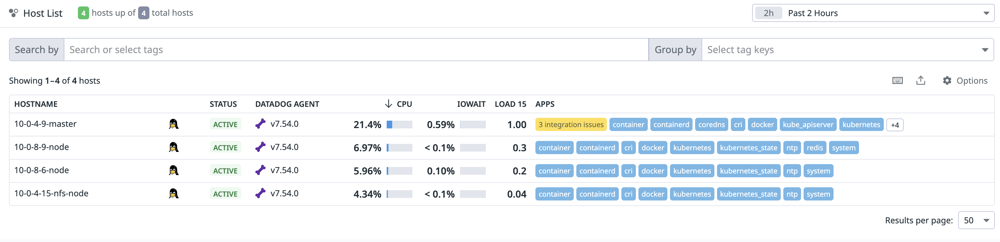

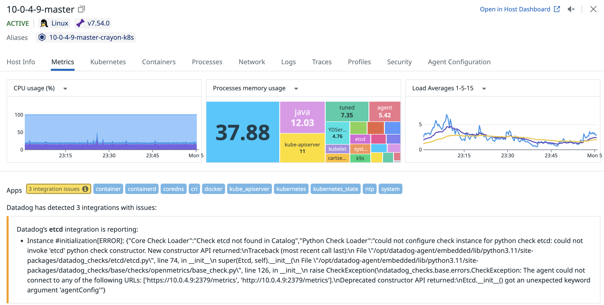

* *纵向数据关联：「Kubernetes」「Host Info」「Containers」「Processes」「Network」，后两个需要额外开启*
* *场景数据关联：「Metrics」「Logs」「Traces」「Profiles」「Security」*

### 1.4 [可选] 监控数据增强

* [Live Processes](https://docs.datadoghq.com/infrastructure/process/?tab=helm)
* [Network Performance Monitoring Setup](https://docs.datadoghq.com/network_monitoring/performance/setup/?tab=operator)

#### 1.4.1 调整配置

编辑 datadog-agent.yaml

```yaml
apiVersion: datadoghq.com/v2alpha1
kind: DatadogAgent
metadata:
  name: datadog
spec:
  features:
    # enable network performance monitoring
    npm:
      enabled: true
    # enable live processes
    liveProcessCollection:
      enabled: true
  global:
    # [1]
    kubelet:
      tlsVerify: false
    clusterName: crayon-k8s
    # [2]
    site: us5.datadoghq.com
    credentials:
      apiSecret:
        secretName: datadog-secret
        keyName: api-key
```

更新 Agent

```shell
kubectl apply -f datadog-agent.yaml
```

## 2. APM

> 文档：https://docs.datadoghq.com/tracing/

### 2.1 数据上报

#### 2.1.0 场景说明

* 以 [opentelemetry-demo](https://github.com/open-telemetry/opentelemetry-demo) 接入为例，部署 namespace
  为 `crayon-otel-demo`
*

Refer：[Sending Data from the OpenTelemetry Demo to Datadog](https://docs.datadoghq.com/opentelemetry/guide/otel_demo_to_datadog/?tab=kubernetes#prerequisites)

#### 2.1.1 创建 secrets

```shell
kubectl create secret generic dd-secrets --from-literal="DD_SITE_PARAMETER=<Your API Site>" --from-literal="DD_API_KEY=<Your API Key>"
```

* *如果能内置 `API Key` 和 `Site` 体验会更好，毕竟类似的 `secrets` 前面安装 Agent 的时候也创建过了*

#### 2.1.2 调整 otel-demo values

```yaml
# otel-demo.yaml
opentelemetry-demo:
  components:
    loadgenerator:
      enabled: true
      envOverrides:
        - name: LOCUST_USERS
          value: "2"
      resources:
        limits:
          memory: 256Mi
  opensearch:
    enabled: false
  opentelemetry-collector:
    extraEnvsFrom:
      - secretRef:
          name: dd-secrets
    config:
      exporters:
        datadog:
          traces:
            span_name_as_resource_name: true
            trace_buffer: 500
          hostname: "otelcol-helm"
          api:
            site: ${DD_SITE_PARAMETER}
            key: ${DD_API_KEY}

      processors:
        resource:
          attributes:
            - key: deployment.environment
              value: "otel"
              action: upsert

      connectors:
        datadog/connector: { }
          # [2]
        # traces:
        #   span_name_as_resource_name: true

      service:
        pipelines:
          traces:
            processors: [ resource, batch ]
            exporters: [ otlp, debug, spanmetrics, datadog, datadog/connector ]
          metrics:
            receivers: [ httpcheck/frontendproxy, otlp, redis, spanmetrics, datadog/connector ]
            processors: [ resource, batch ]
            exporters: [ otlphttp/prometheus, debug, datadog ]
          logs:
            processors: [ resource, batch ]
            exporters: [ debug, datadog ]
```

* *[1] 注释以解决报错：error decoding 'connectors': error reading configuration for "datadog/connector": 1 error(s)
  decoding: '' has invalid keys: traces*

```shell
helm upgrade -n crayon-otel-demo  crayon-otel-demo  crayon/crayon-otel-demo -f otel-demo.yaml
```

### 2.2 功能体验

#### 2.2.1 服务

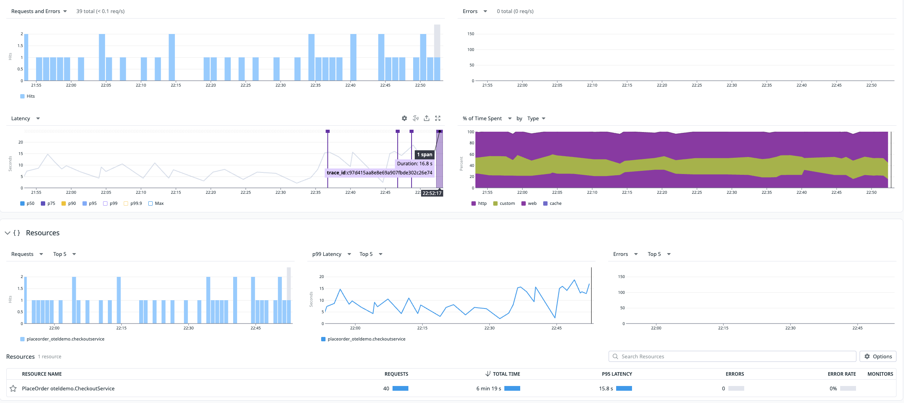

* 突出异常耗时的 span，可以下钻查看调用链
* 可以根据请求类型/下游服务聚合，分析服务耗时分布情况
* 展示 RED & USE 核心指标，可以对图表进行一定的维度聚合和自定义

#### 2.2.2 服务拓扑

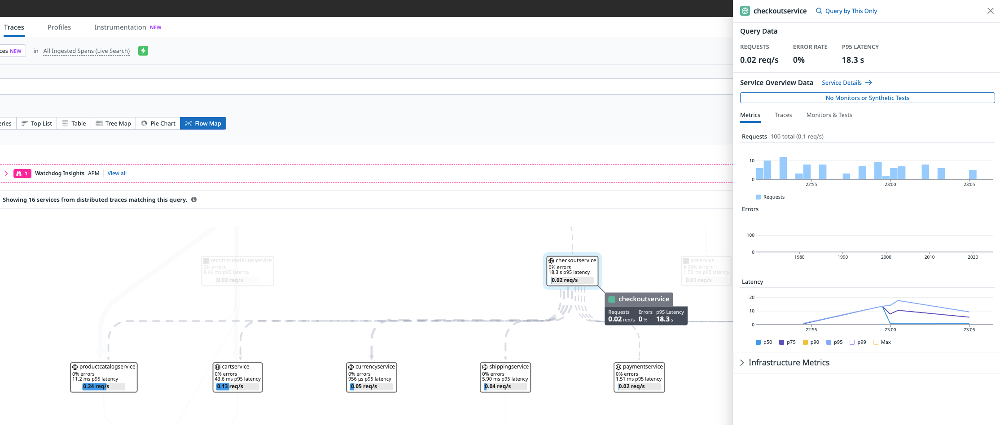

* 可以和 Trace 过滤联动，这个功能很赞，能分析耗时长 / 错误 / 特定服务或接口的调用链路
* 缺点：耗时展示并不明显

#### 2.2.3 Trace 检索模板

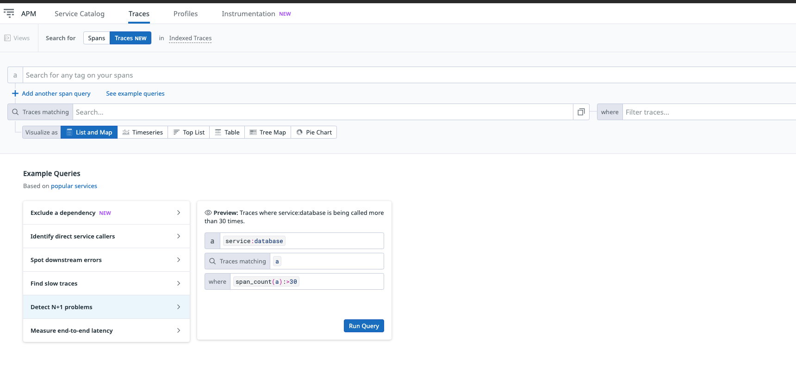

* 💡 定义常见的 Trace 检索语句
* 更多检索用法：[Trace Queries](https://docs.datadoghq.com/tracing/trace_explorer/trace_queries/)

#### 2.2.4 数据关联

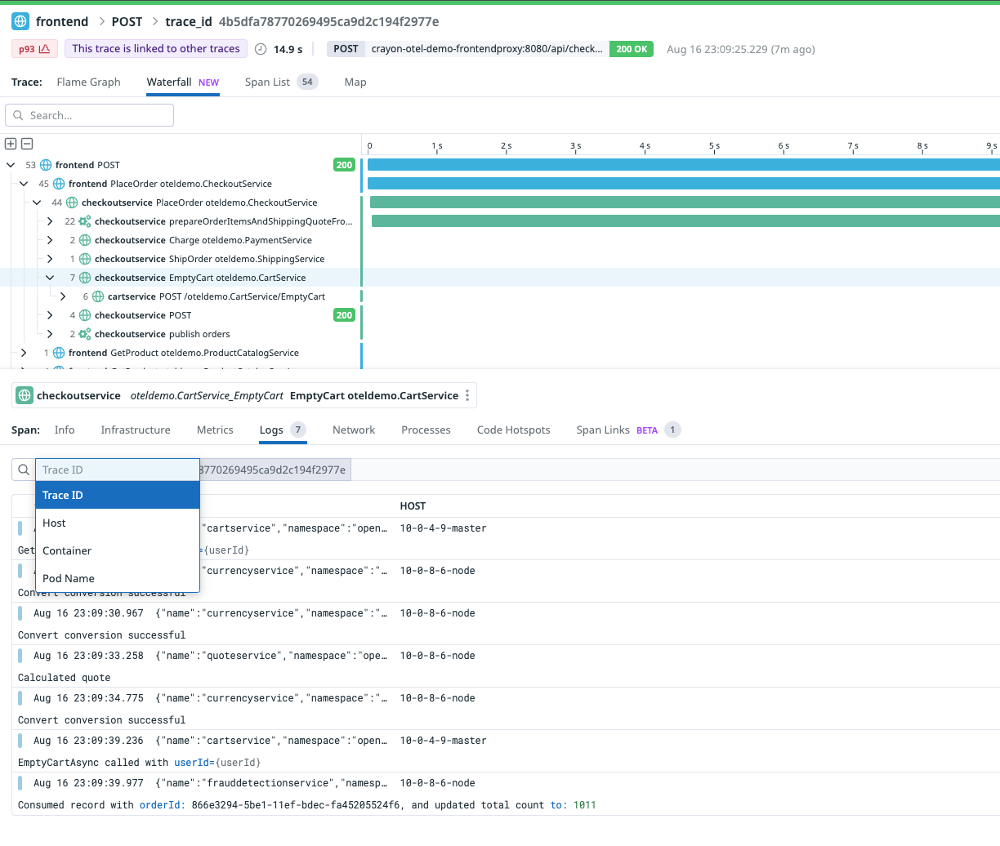

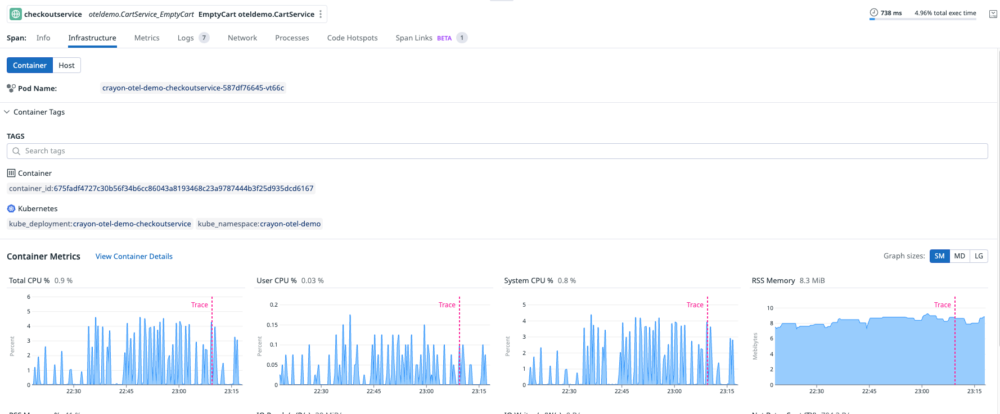

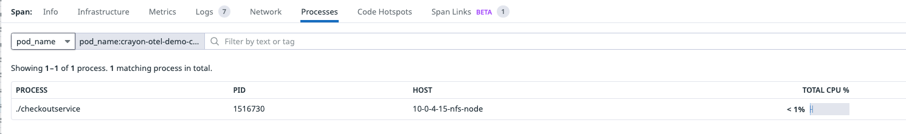

* 可以根据 `TraceID` `Pod` 等维度，辅助过滤关联数据，这个功能也很好用
* 数据基本只展示概览，可以携带条件、时间范围跳转到场景页

#### 2.2.5 异常定位

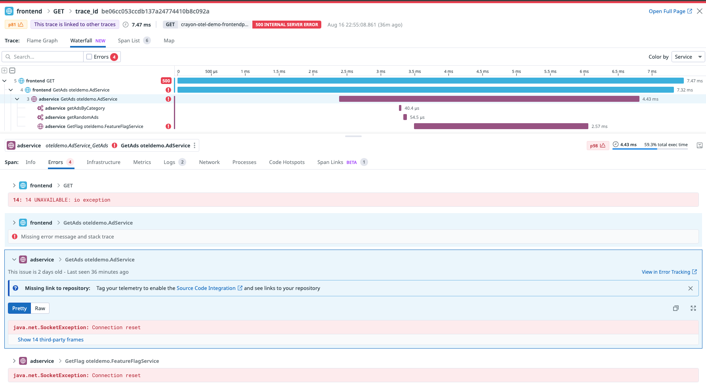

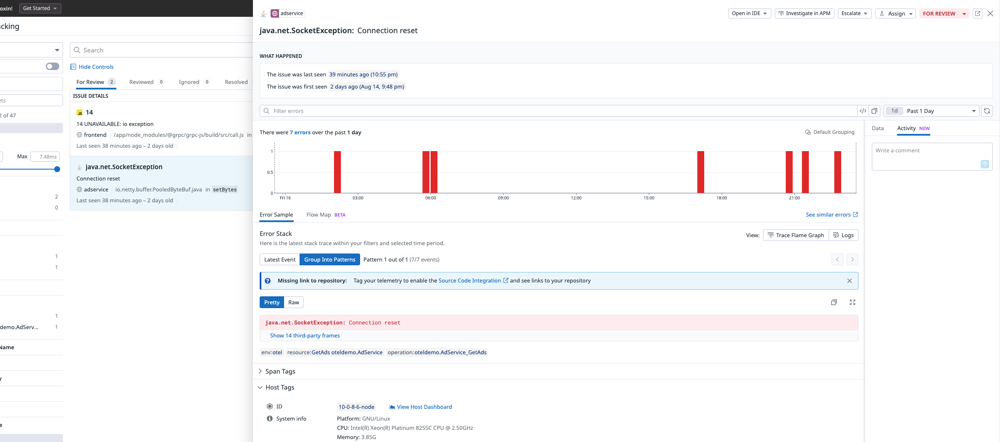

* 跳转 Trace or Log
* 错误聚合很好用，比如发布场景、项目代码优化巡检
* 一些新的方向
    * 关联代码库，基于 Agent 的能力动态插桩，预埋探针获取特定代码位置的日志 / 指标
    * [Dynamic Instrumentation](https://docs.datadoghq.com/dynamic_instrumentation/?site=us5)

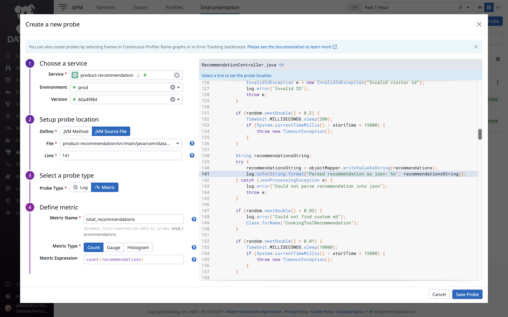

#### 2.2.6 Resource 上下游分析

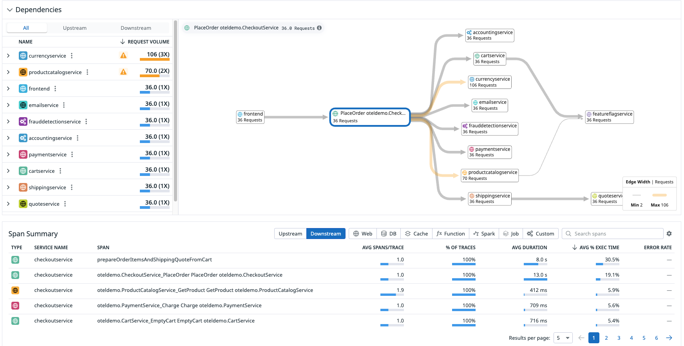

## 3. Tags

是一种「补充」观测维度的方法，用于 DataDog 相关数据的过滤、聚合、比较，目前提供的 KEY：

* `host`
* `device`
* `source`
* 🌟 `service`
* 🌟 `env`
* 🌟 `version`
* `team`

注入方式：

* 容器化：推荐
    * [Basic Agent Autodiscovery](https://docs.datadoghq.com/getting_started/containers/autodiscovery/?tab=adannotationsv2agent736)

场景：

* 版本流量 - group by `version`

注入可行性：

* DataDog 基于 “OneAgent” 进行工作

文档：https://docs.datadoghq.com/getting_started/tagging/

## 4. 场景

### 4.1 IO 飙升

19:39 网络流量出现毛刺，随后节点 NotReady

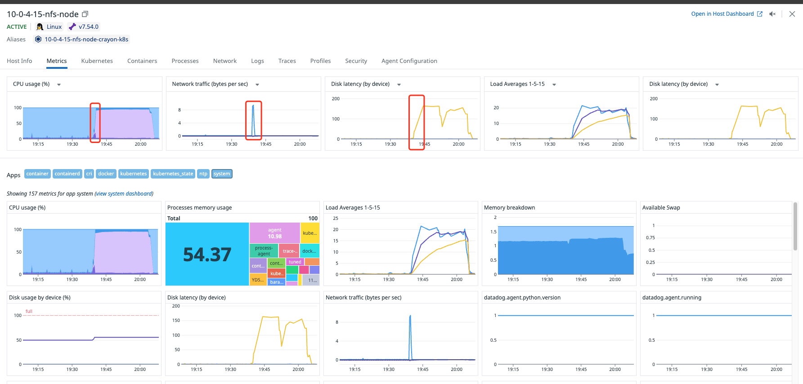

移动到毛刺处查看关联的数据

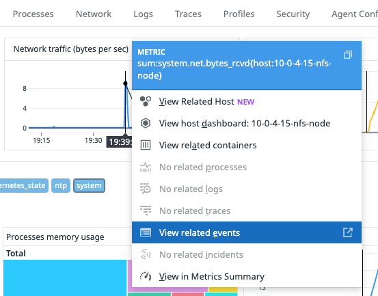

关联容器：可以明显看到 `loadgenerator_crayon-otel-demo-loadgenerator-6d597c8b45-zb22v` IO 读特别高

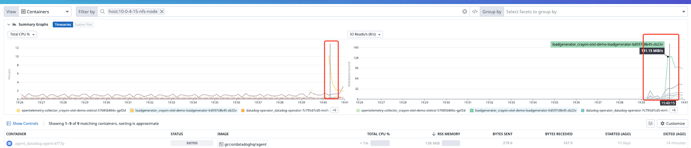

容器详情查看「Related Resources」，可以看到此时的 Node 已经挂了

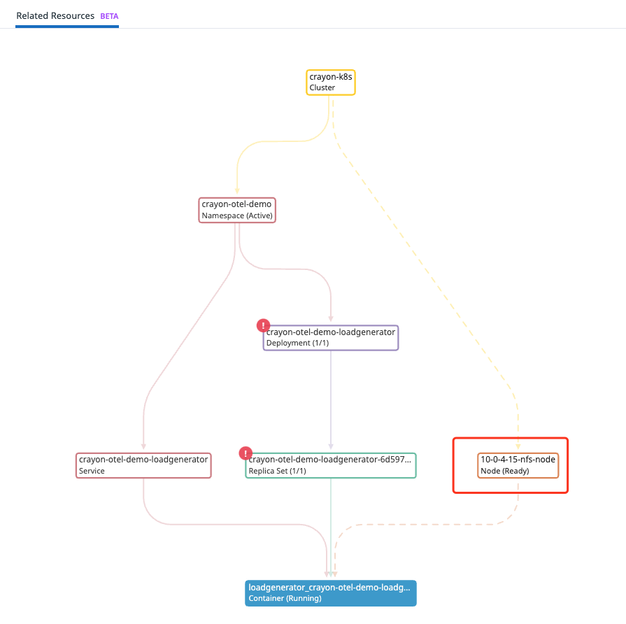

关联事件：NotReady 发生在 IO 飙升之后

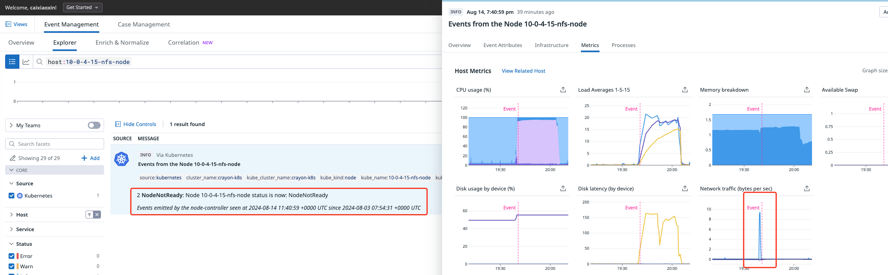

往前推一个时间窗口，NotReady 发生在 `loadgenerator_crayon-otel-demo-loadgenerator-6d597c8b45-zb22v`
创建之后，到这基本能断定，是 ``loadgenerator` 部署后引起的 IO 飙升

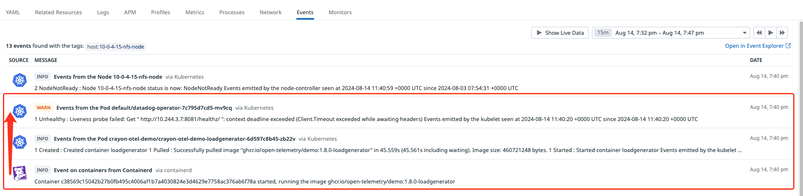

* *关联事件下钻这里没有很好用，一开始只展示「WARN」的事件，如果有时间 & 容器相关性分析，展示出 loadgenerator
  创建的事件，应该会更直观一些*
